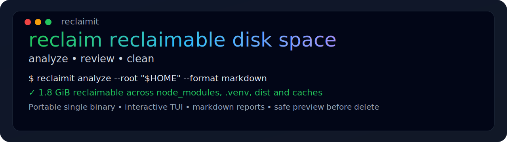
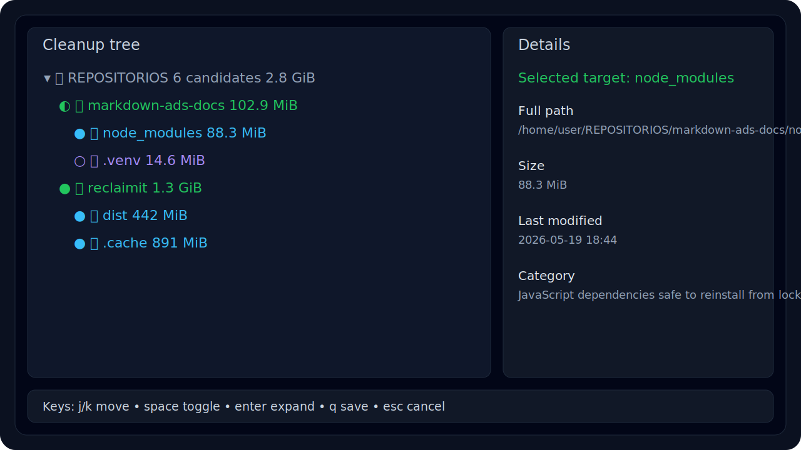

# reclaimit



[](https://github.com/svg153/reclaimit/actions/workflows/ci.yml) [](https://github.com/svg153/reclaimit/releases/latest) [](https://golang.org) [](https://codecov.io/gh/svg153/reclaimit) [](./LICENSE)



## Table of contents

- [Installation](#installation)
- [Quick start](#quick-start)
- [Architecture and review](#architecture-and-review)
- [Commands](#commands)
- [Security & automation](#security--automation)
- [Contributing](#contributing)

`reclaimit` is a Go CLI for finding reclaimable disk space with a bias toward **developer workstations**.

It scans a root directory, identifies well-known cleanup targets such as `node_modules`, virtual environments, caches and build artifacts, and lets you review them either as:

- a **plain-text report**
- a **Markdown report** with tables, Mermaid and PlantUML blocks
- an **interactive TUI** with a path tree, context folders, and exact delete targets

## Why this tool exists

Classic disk analyzers are good at answering **“what is big?”**.

This tool is optimized for **“what is safe enough to review for deletion?”**.

That means it knows about common development leftovers like:

- `node_modules`
- `.venv`, `venv`, `.tox`
- `__pycache__`, `.pyc`, `.pyo`
- `.pytest_cache`, `.mypy_cache`
- `dist`, `build`, `target`
- `.next`, `.nuxt`
- `.cache`

## Key capabilities

- **Fast local analysis** using a single Go binary
- **Candidate-aware cleanup** instead of raw size reporting only
- **Repository-aware grouping** with `--group-mode repo`
- **Path-tree TUI** built with `tview` / `tcell`
- **Context nodes** that never imply deleting the repository root itself
- **Exact-path exclusions** via `--exclude-path`
- **Prefix-based group exclusions** via `--exclude-group`
- **Last-modified timestamps** in Markdown output and TUI details
- **Safe clean flow** with deletion preview before destructive actions

## Installation

### Homebrew

```bash
brew install svg153/reclaimit/reclaimit
```

### Quick install script

Requires `curl` and `jq`:

```bash
curl -fsSL https://raw.githubusercontent.com/svg153/reclaimit/main/install.sh | bash
```

Installs to:

```bash
$HOME/.local/bin/reclaimit
```

### Go install

```bash
go install github.com/svg153/reclaimit@latest
```

### Linux packages (apt, dnf/yum, apk)

Release builds publish native `.deb`, `.rpm`, and `.apk` packages. Download the
package matching your distribution from the
[latest release](https://github.com/svg153/reclaimit/releases/latest) and
install it:

```bash
# Debian / Ubuntu
sudo apt install ./reclaimit_*_linux_amd64.deb

# Fedora / RHEL / openSUSE
sudo dnf install ./reclaimit_*_linux_amd64.rpm

# Alpine
sudo apk add --allow-untrusted ./reclaimit_*_linux_amd64.apk
```

### Docker

A minimal, non-root distroless image is published to GitHub Container Registry:

```bash
docker run --rm ghcr.io/svg153/reclaimit:latest --help

# Analyze a host directory by mounting it read-only
docker run --rm -v "$HOME:/scan:ro" ghcr.io/svg153/reclaimit:latest \
  analyze --root /scan --format markdown
```

Build the image locally with `task docker-build`.

### Build from source

```bash
git clone https://github.com/svg153/reclaimit.git
cd reclaimit
task build
./bin/reclaimit --version
```

### Install into your user PATH from source

```bash
task install
reclaimit --version
```

## Quick start

### 1. Generate a Markdown report

```bash
./bin/reclaimit analyze --root "$HOME" --format markdown --out report.md
```

### 2. Explore cleanup candidates interactively

```bash
./bin/reclaimit tui --root "$HOME" --format markdown
```

### 3. Delete a reviewed subset

```bash
./bin/reclaimit clean --root "$HOME" --include-category python-venv --yes
```

## Architecture and review

Repository documentation is available in [docs/architecture.md](docs/architecture.md) and [docs/code-review.md](docs/code-review.md).

Current repository layout:

- root package `reclaimit` contains command orchestration and scanner/report logic
- `cmd/reclaimit/main.go` is the executable entrypoint
- `internal/tui` contains the reusable TUI package used by the root command flow

Those documents include:

- Mermaid C4 diagrams for system, container, and component views
- command and safety flows for `analyze`, `tui`, and `clean`
- a technical review of shallow helpers, duplicated logic, test gaps, and performance opportunities

## Commands

### `analyze`

Generate a plain-text or Markdown report.

```bash
./bin/reclaimit analyze --root "$HOME" --format markdown --out report.md
```

Useful flags:

- `--root PATH`
- `--format plain|markdown`
- `--group-mode repo|depth`
- `--group-depth N`
- `--exclude-group PATH`
- `--exclude-path PATH`
- `--out FILE`

### `tui`

Open the interactive tree UI.

```bash
./bin/reclaimit tui --root "$HOME"
```

TUI semantics:

- **Context folders** (`📁`) are grouping nodes only.
- Toggling a context folder **does not mean deleting that folder itself**.
- **Deletion candidates** are explicit target nodes:
  - `🧹` directory target
  - `📄` file target

Default shortcuts:

- `j/k` or `↑/↓` — move
- `Enter` or `→` — expand
- `←` — collapse / move to parent
- `Space` — toggle current node
- `a` — toggle all
- `q` — save selection and exit
- `Esc` — discard changes and exit

### `clean`

Delete the currently selected candidate set.

```bash
./bin/reclaimit clean --root "$HOME" --include-category node-modules --yes
```

Behavior:

- prints a **preview** of what will be deleted
- deletes the selected candidates
- prints a **fresh post-clean report**

## Exclusions and selection rules

### `--exclude-group`

Excludes a whole subtree by prefix match.

Example:

```bash
./bin/reclaimit analyze --root "$HOME" --exclude-group "$HOME/REPOS/project-a"
```

### `--exclude-path`

Excludes **one exact candidate path**.

It is **not** a prefix match.

Example:

```bash
./bin/reclaimit analyze --root "$HOME" \
  --exclude-path "$HOME/REPOS/project-a/.venv"
```

## Markdown report output

The Markdown report includes:

- executive summary table
- Mermaid charts
- PlantUML mindmap block
- collapsible sections for large tables
- candidate and group **last-modified timestamps**

This makes the output useful for:

- sharing in issues or pull requests
- archiving cleanup snapshots
- post-processing in other tools

## Safety model

This tool is opinionated, but intentionally conservative:

- it only flags known cleanup categories
- it separates **context** from **actual delete targets**
- it supports exclusions before cleaning
- it requires `--yes` for destructive cleanup

Still, this is a cleanup tool: review output before deletion, especially for generic cache directories.

## Observability

`reclaimit` emits structured logs via the standard library `log/slog`. Logs go
to **stderr** while reports go to **stdout**, so machine-readable output is never
polluted by diagnostics. Control verbosity with `--log-level`:

```bash
# Trace every scanned directory and candidate match
./bin/reclaimit analyze --root "$HOME" --log-level debug
```

Accepted levels: `debug`, `info`, `warn` (default) and `error`. Unreadable
entries (permission denied) are reported at `warn` and skipped rather than
aborting the scan.

## Development

Common Taskfile targets:

```bash
task fmt      # gofmt
task vet      # go vet
task lint     # golangci-lint (downloaded on demand, pinned)
task vulncheck # govulncheck SCA scan
task test     # tests + coverage summary
task bench    # benchmarks with allocation stats
task fuzz     # bounded fuzz run of the file matcher
task build    # build ./bin/reclaimit
task docker-build # build the distroless container image
task check    # full quality gate: fmt, vet, lint, vulncheck, coverage, build
```

## Testing and coverage

The repository includes:

- scanner tests
- cleanup tests
- render helper tests
- TUI tree/helper tests
- help/usage tests

Generate coverage locally:

```bash
task test
task coverage-html
```

## CI

GitHub Actions workflows are included for:

- tests on Go `1.24` and `1.25` with a 70% coverage gate
- `golangci-lint` static analysis
- `govulncheck` dependency/code vulnerability scanning (SCA)
- CodeQL analysis
- Docker image build (and publish to GHCR on `main`/tags)
- tagged releases via GoReleaser (binaries, `.deb`/`.rpm`/`.apk`, checksums)

## Security & automation

The repository includes:

- Dependabot for Go modules and GitHub Actions
- CodeQL analysis on pushes, pull requests and schedule
- `govulncheck` SCA scanning in CI
- coverage artifacts in CI plus Codecov upload
- GoReleaser-driven releases publishing binaries, Linux packages and checksums
- a non-root distroless container image published to GHCR

For webinstall.dev specifically, this repository now ships a portable `install.sh`, but final publication still requires submitting the installer metadata upstream to `webinstall/webi-installers`.

## Roadmap ideas

- richer filtering by age / last-modified thresholds
- export/import of reviewed selections
- release pipeline for prebuilt binaries
- ignore rules file
- optional JSON output for automation

## Contributing

Contributions are welcome.

If you open a change, prefer:

- focused PRs
- tests for new behavior
- updated help/README when CLI behavior changes

## License

MIT — see [`LICENSE`](./LICENSE).
