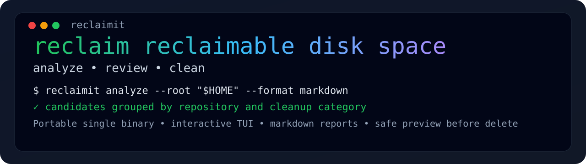

# reclaimit — Developer disk cleanup CLI

[](https://github.com/svg153/reclaimit/releases/latest)
[](go.mod)
[](LICENSE)



`reclaimit` is a cross-platform Go CLI and terminal UI for developer disk
cleanup. It finds regenerable build artifacts and caches, groups them by
project, and lets you review them before deletion.

Traditional disk analyzers answer **“what is large?”**. `reclaimit` adds the developer context needed to answer **“what can I recreate if I delete it?”**.



The demo uses generated files and makes no typical-savings claim. Its exact
fixture and commands are documented in [docs/demo.md](docs/demo.md).

## Install

The corrected release is awaiting publication in
[issue #48](https://github.com/svg153/reclaimit/issues/48). Until it is
published, install the audited current source with Go 1.25.12 or newer:

```bash
go install github.com/svg153/reclaimit/cmd/reclaimit@main
```

Do not use the one-line release installer yet: it intentionally refuses the
older release because that release has no SHA-256 manifest. Once #48 is closed,
the installer and prebuilt Linux, macOS, and Windows archives will be the
recommended paths.

## What it does

- Detects 17 cleanup categories for JavaScript, Python, Rust, frontend builds, Bun, pip, pipx, and macOS metadata.
- Groups candidates by Git repository or path depth instead of presenting one flat list.
- Produces plain-text, Markdown, or JSON reports and includes an interactive TUI.
- Requires explicit confirmation for cleanup and supports a non-destructive `--dry-run`.
- Revalidates identity, type, size, and modification snapshot, then uses a
  same-filesystem quarantine so changed data is preserved.
- Ships as one Go binary for Linux, macOS, and Windows.

## Quick start

```bash
# Inspect a workspace in the terminal
reclaimit analyze --root "$HOME/code"

# Export machine-readable scan metrics
reclaimit analyze --root "$HOME/code" --format json --out reclaimit-report.json

# Review candidates interactively
reclaimit tui --root "$HOME/code"

# Preview one category without deleting anything
reclaimit clean --root "$HOME/code" --include-category python-venv --dry-run

# Delete only after reviewing the same selection
reclaimit clean --root "$HOME/code" --include-category python-venv --yes
```

## Supported cleanup categories

| Ecosystem | Detected paths |
| --- | --- |
| JavaScript and frontend | `node_modules`, `dist`, `build`, `.next`, `.nuxt` |
| Python | `.venv`, `venv`, `__pycache__`, `*.pyc`, `*.pyo`, `.pytest_cache`, `.mypy_cache`, `.tox` |
| Python package tools | `.cache/pip`, `.local/pipx` |
| Rust | `target` |
| Bun | `.bun/install/cache` |
| Generic caches | `.cache` |
| macOS | `.DS_Store`, `.Spotlight-V100`, `.Trashes` |

Generic caches and pipx-managed environments can contain useful or costly-to-recreate data. `reclaimit` describes these candidates but leaves the decision to you.

## reclaimit vs ncdu, gdu, dust, and dua

[`ncdu`](https://dev.yorhel.nl/ncdu),
[`gdu`](https://github.com/dundee/gdu),
[`dust`](https://github.com/bootandy/dust), and
[`dua`](https://github.com/Byron/dua-cli) are general disk usage analyzers.
`reclaimit` is narrower: it recognizes developer artifacts and adds a guarded,
project-aware cleanup workflow. It is a companion for these tools, not a
drop-in replacement.

| Capability | reclaimit | General disk analyzer |
| --- | --- | --- |
| Primary signal | Regenerable artifact category | File and directory size |
| Project context | Git repository or path grouping | Filesystem hierarchy |
| Automation output | JSON, Markdown, plain text | Tool-dependent |
| Cleanup guard | Dry run plus pre-delete revalidation | Tool-dependent/manual selection |

The tools complement each other: use a general analyzer to understand the whole disk and `reclaimit` to review known developer cleanup candidates.

## Commands and important flags

| Command | Purpose |
| --- | --- |
| `analyze` | Scan and produce a report |
| `tui` | Review results in an interactive terminal tree |
| `clean` | Preview or delete selected candidates |

- `--root PATH`: directory to scan; defaults to the current directory.
- `--format plain|markdown|json`: report format.
- `--group-mode repo|depth`: group by Git repository or path depth.
- `--max-depth N`: traversal limit; `0` means unlimited.
- `--workers N`: global scanner concurrency ceiling; defaults to `8`.
- `--include-category VALUE`: include one category; repeatable.
- `--exclude-category VALUE`: exclude one category; repeatable.
- `--exclude-group PATH`: exclude a path prefix; repeatable.
- `--exclude-path PATH`: exclude one exact candidate path; repeatable.
- `--ignore-file FILE`: read excluded paths from a file, one per line.
- `--out FILE`: write the report to a file.
- `--dry-run`: run cleanup preflight without deleting.
- `--yes`: confirm destructive cleanup.

Run `reclaimit help analyze`, `reclaimit help tui`, or `reclaimit help clean` for the complete help text.

## Safety model

`analyze` and `tui` are read-only. `clean` requires either `--dry-run` or `--yes`.

Before deleting, `reclaimit` collapses nested selections and checks that each
path still exists and matches the type, identity, size, and modification
snapshot observed by the scan. It then atomically renames each verified item
into a private same-filesystem quarantine, checks it again, and only deletes the
quarantined object. Changed data is preserved and its recovery path is included
in plain-text, Markdown, and JSON cleanup results.

Deletion is still irreversible and cannot be transactional on a normal filesystem. Review the dry run, keep backups for valuable data, and avoid running cleanup against paths you do not understand.

## Build and contribute

```bash
git clone https://github.com/svg153/reclaimit.git
cd reclaimit

go test ./...
go test -race ./...
go vet ./...
go run github.com/golangci/golangci-lint/v2/cmd/golangci-lint@v2.1.6 run ./...
go build -o ./bin/reclaimit ./cmd/reclaimit
```

The optional [Task](https://taskfile.dev/) shortcuts are documented in `Taskfile.yml`. See [CONTRIBUTING.md](CONTRIBUTING.md) for contribution guidelines and [docs/architecture.md](docs/architecture.md) for the design, scanner limits, and cleanup contract.

Performance measurements include their fixture, environment, raw command, and
interpretation limits in [docs/benchmarks.md](docs/benchmarks.md). Growth is
tracked without product telemetry in [docs/growth.md](docs/growth.md).

## Roadmap

- Expand cleanup categories only with explicit safety descriptions and tests.
- Keep behavioral coverage above 90% overall and in every production package
  and source file.
- Add age-based filters and export/import of reviewed selections.
- Review release acquisition after 30 days and select new cleanup categories
  from opt-in, privacy-preserving evidence.

Focused pull requests, bug reports, category proposals, and documentation improvements are welcome.

## License

MIT — see [LICENSE](LICENSE).
