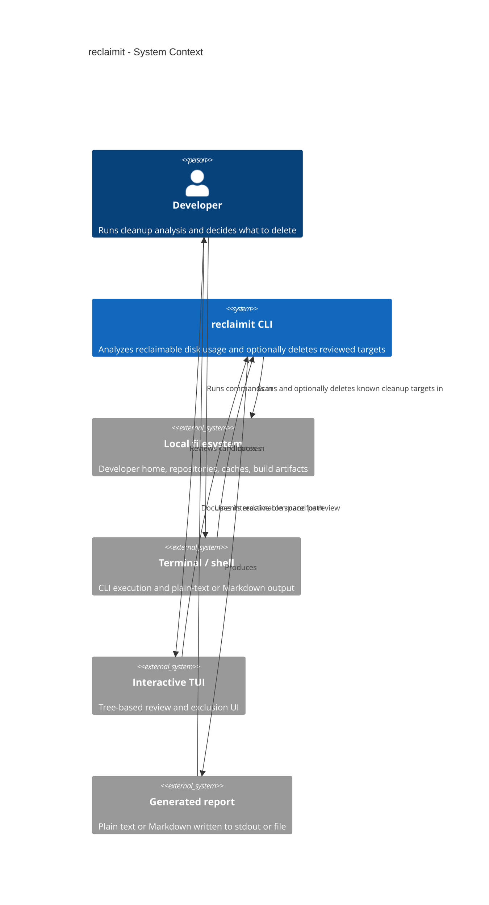
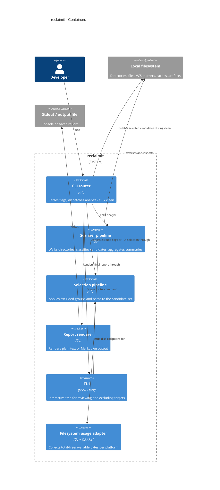
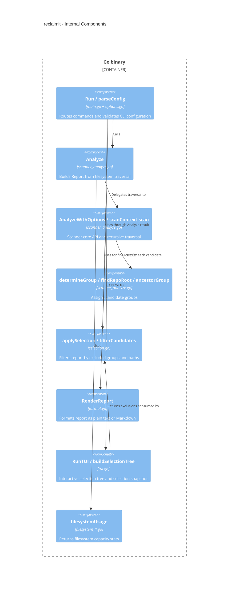
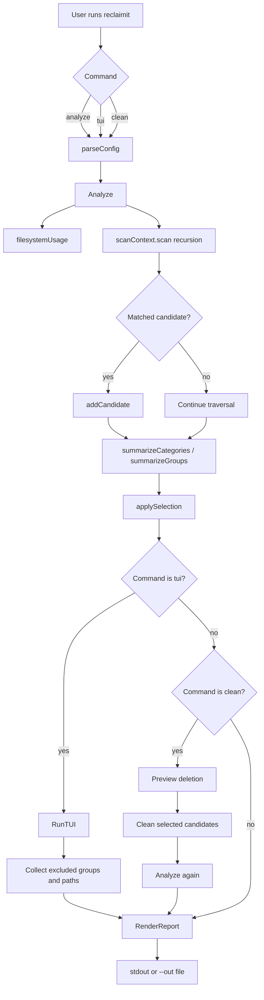
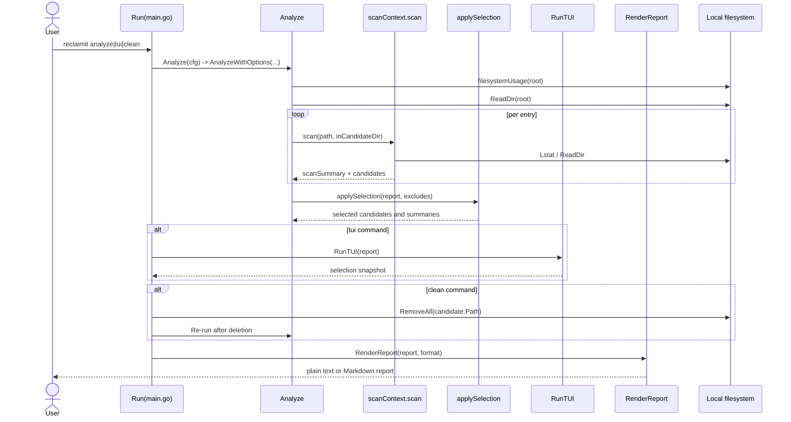
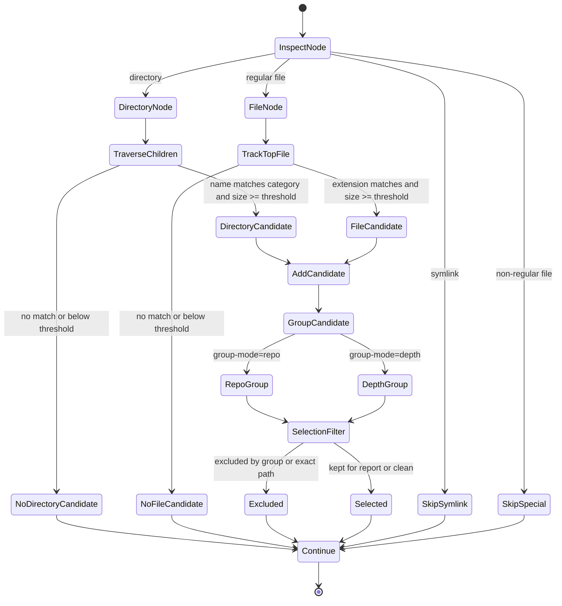

# Architecture and Execution Flows

This document explains how `reclaimit` is structured and how the main commands move through the code.

## Scope

`reclaimit` is a single-binary Go CLI focused on developer-workstation cleanup analysis. The core behavior lives in a small set of modules:

- `cmd/reclaimit/main.go` is the executable entrypoint.
- `main.go` in the root package `reclaimit` orchestrates commands and output.
- scanner logic is split across `scanner_types.go`, `scanner_categories.go`, `scanner_analyze.go`, `scanner_summaries.go`, and `scanner_clean.go`.
- `selection.go` filters candidates after CLI or TUI selection.
- `tui.go` lets the user review and exclude targets interactively.
- `format.go` renders the final report.
- `internal/tui/tui.go` contains the reusable internal TUI package.
- `filesystem_unix.go` and `filesystem_windows.go` isolate per-platform filesystem usage data.

## C4: System Context

## C4: Container View

## C4: Component View

## Command Flow

## Runtime Sequence

## Candidate Detection and Safety Decisions

## Notes for Maintainers

- `Analyze` is the core module. Both `tui` and `clean` reuse it rather than implementing their own scan logic.
- `scanContext.scan` and helpers (`scanDir`, `scanFile`) concentrate most traversal behavior and remain the primary extension seam.
- Selection is a seam: exclusion logic is centralized in `selection.go` and reused by CLI flags and TUI output.
- The Windows filesystem adapter calls `GetDiskFreeSpaceExW` and returns real metrics with overflow-safe clamping.
